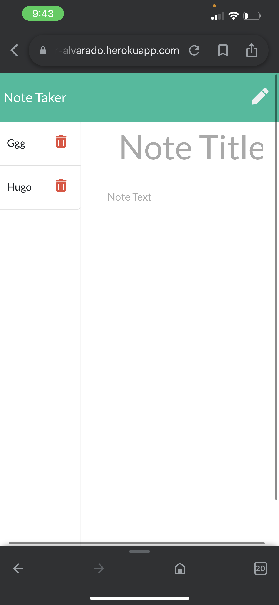

# note-taker

💻 Below is the picture of the application:
# screen shot 
 

 Application deployed live on https://notetaker-alvarado.herokuapp.com/

 
 
## Description
🔍 A node.js express.js application that uses user input to create, store and delete notes.

## Table of Contents
- [Description](#description)
- [Installation](#installation)
- [Usage](#usage)
- [License](#license)
- [Contributing](#contributing)
- [Tests](#tests)
- [Questions](#questions)
## Installation
💾

npm init

npm install node

npm install express

npm install jest --save-dev

'heroku create

## Usage
💻

Run the following command at the root of your project and answer the prompted questions:

npm start

## License

 
This application is covered by the MIT license. 
## Contributing
hugo Alvarado
## Tests
✏️ npm install jest --save-dev

## Questions
✋  email me or reach out on GitHub 
 
:octocat: Find me on GitHub: [rober2092](https://github.com/rober2092) 
 
✉️ Email me with any questions: rober2091@icloud.com  
_This README was generated with ❤️ by [note-taker](https://github.com/Rober2092/note-taker) 🔥🔥🔥_
    